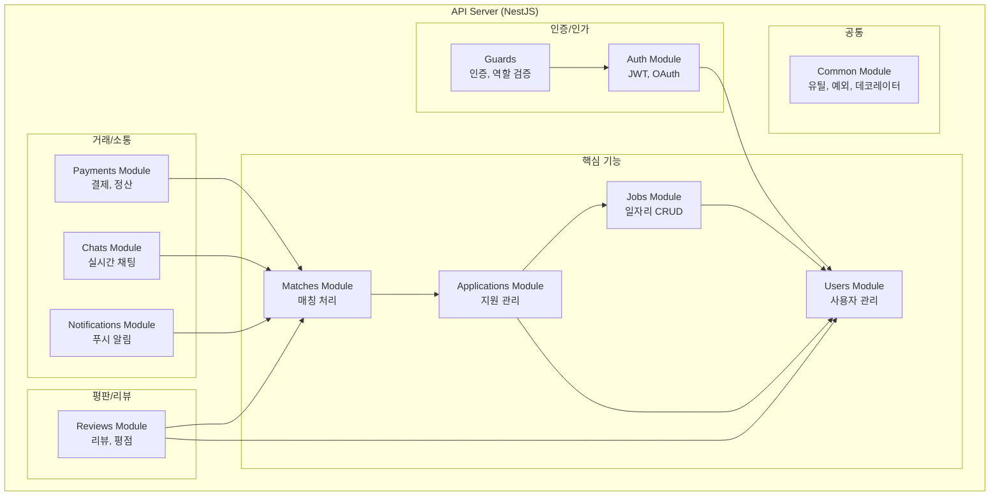

# C4 모델 - Level 3: Component Diagram (Backend)

API Server 내부의 주요 컴포넌트 구조입니다.



## 모듈별 책임

### 인증/인가
| 모듈 | 파일 위치 | 책임 |
|------|-----------|------|
| Auth | `src/auth/` | JWT 발급/검증, OAuth, 리프레시 토큰 |
| Guards | `src/common/guards/` | 인증 상태, 역할(구인자/구직자/관리자) 검증 |

### 핵심 기능
| 모듈 | 파일 위치 | 책임 |
|------|-----------|------|
| Users | `src/users/` | 회원가입, 프로필, 본인인증 |
| Jobs | `src/jobs/` | 일자리 등록/수정/삭제/검색 |
| Applications | `src/applications/` | 지원 신청, 지원 취소 |
| Matches | `src/matches/` | 지원 수락 → 매칭 생성, 상태 관리 |

### 거래/소통
| 모듈 | 파일 위치 | 책임 |
|------|-----------|------|
| Payments | `src/payments/` | 토스페이먼츠 연동, 예치금, 정산 |
| Chats | `src/chats/` | 채팅방 생성, 메시지 저장, WebSocket |
| Notifications | `src/notifications/` | FCM 푸시, 인앱 알림 |

### 평판/리뷰
| 모듈 | 파일 위치 | 책임 |
|------|-----------|------|
| Reviews | `src/reviews/` | 양방향 리뷰, 평점 계산 |

## 데이터 흐름 예시

### 일자리 지원 → 매칭 성립 흐름
```
1. [구직자] POST /applications (지원)
   → ApplicationsService.create()
   → NotificationsService.sendToEmployer()

2. [구인자] PATCH /applications/:id/accept (수락)
   → ApplicationsService.accept()
   → MatchesService.create()
   → ChatsService.createRoom()
   → NotificationsService.sendToWorker()

3. [매칭 성립] Match 엔티티 생성
   → PaymentsService.holdDeposit() (예치금 홀드)
```
