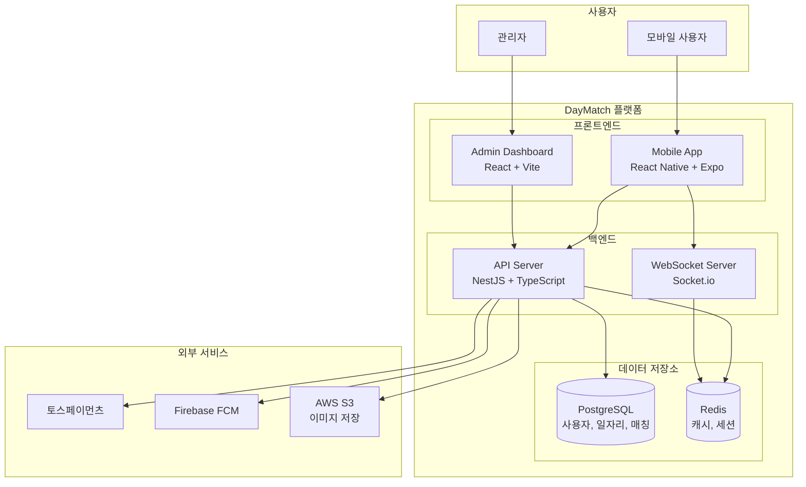

# C4 모델 - Level 2: Container Diagram

DayMatch 시스템 내부의 컨테이너(애플리케이션, 데이터베이스 등) 구조입니다.

## 컨테이너 상세

| 컨테이너 | 기술 스택 | 역할 | 배포 |
|----------|-----------|------|------|
| Mobile App | React Native, Expo, Redux Toolkit | 구인자/구직자용 모바일 앱 | EAS Build |
| Admin Dashboard | React, Vite, Tailwind CSS | 운영팀용 관리 대시보드 | Vercel |
| API Server | NestJS, TypeScript, TypeORM | REST API, 비즈니스 로직 | Railway |
| WebSocket Server | Socket.io | 실시간 채팅, 알림 | Railway (API와 동일) |
| PostgreSQL | PostgreSQL 15 | 주요 데이터 저장 | Railway (Managed) |
| Redis | Redis 7 | 캐시, 세션, Pub/Sub | Railway (Managed) |

## 통신 방식

| 출발 | 도착 | 프로토콜 | 설명 |
|------|------|----------|------|
| Mobile → API | REST | HTTPS | 일자리 CRUD, 인증 등 |
| Mobile → Socket | WebSocket | WSS | 실시간 채팅 |
| Admin → API | REST | HTTPS | 관리 기능 |
| API → PostgreSQL | TCP | TypeORM | 데이터 영속화 |
| API → Redis | TCP | ioredis | 캐싱, 세션 관리 |
| Socket → Redis | TCP | Pub/Sub | 다중 인스턴스 메시지 동기화 |

## 확장 고려사항

### 현재 (MVP)
- 단일 API 인스턴스
- Railway 관리형 PostgreSQL/Redis

### 향후 (Scale-up)
- API 수평 확장 (Redis Pub/Sub로 Socket 동기화)
- PostgreSQL Read Replica
- CDN (CloudFront) for 정적 자산
