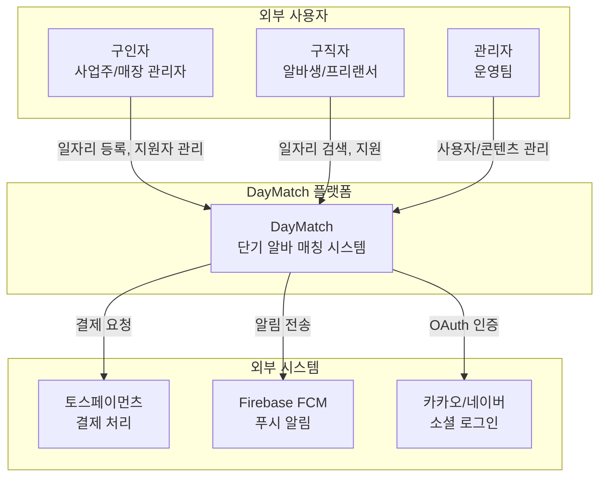

# C4 모델 - Level 1: System Context

DayMatch 시스템과 외부 사용자/시스템의 관계를 보여주는 최상위 다이어그램입니다.

## 시스템 참여자

| 참여자 | 유형 | 설명 |
|--------|------|------|
| 구인자 | 사용자 | 일자리를 등록하고 구직자를 고용하는 사업주 |
| 구직자 | 사용자 | 단기 일자리를 찾는 알바생/프리랜서 |
| 관리자 | 내부 사용자 | 플랫폼을 운영하는 DayMatch 운영팀 |
| 토스페이먼츠 | 외부 시스템 | 결제 처리 및 정산 |
| Firebase FCM | 외부 시스템 | 모바일 푸시 알림 |
| 카카오/네이버 | 외부 시스템 | 소셜 로그인 OAuth 제공자 |

## 주요 상호작용

1. **구인자 → 시스템**: 일자리 등록, 지원자 확인/수락, 근무 완료 승인
2. **구직자 → 시스템**: 일자리 검색, 지원, 채팅, 근무 완료 확인
3. **관리자 → 시스템**: 사용자 관리, 분쟁 조정, 통계 모니터링
4. **시스템 → 토스페이먼츠**: 예치금 결제, 구직자 정산
5. **시스템 → FCM**: 매칭 알림, 채팅 알림, 근무 리마인더
